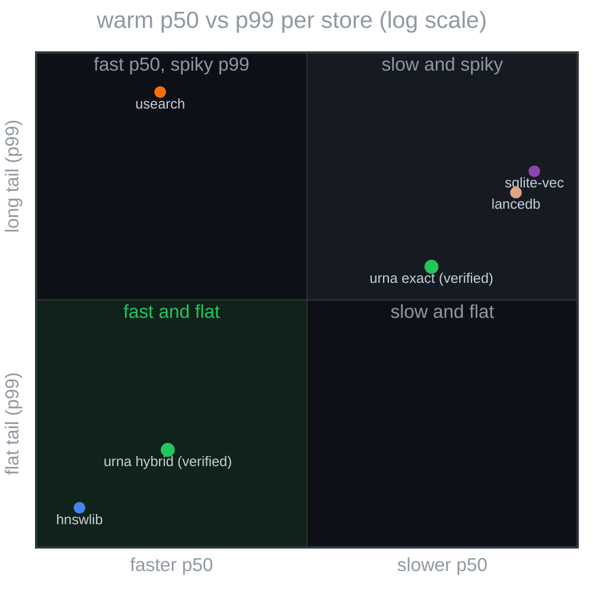
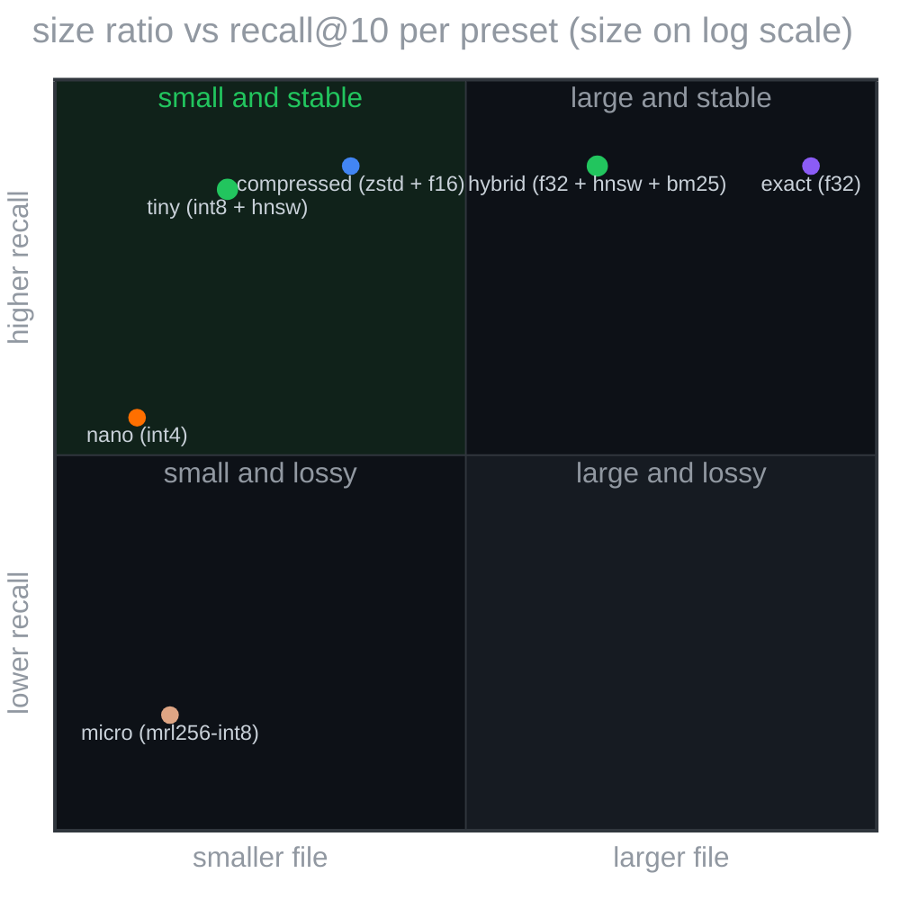
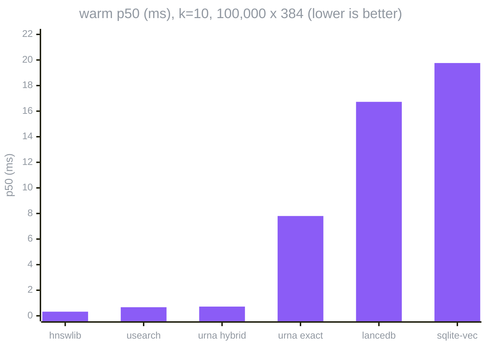
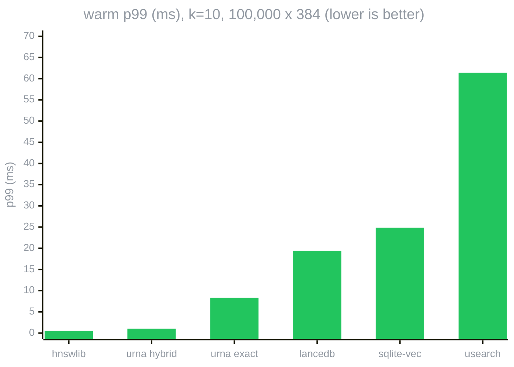
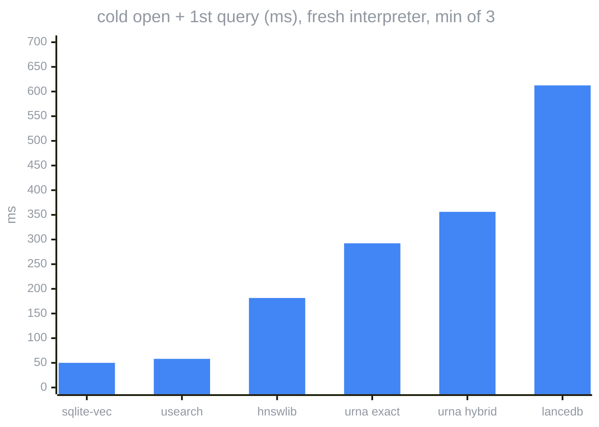
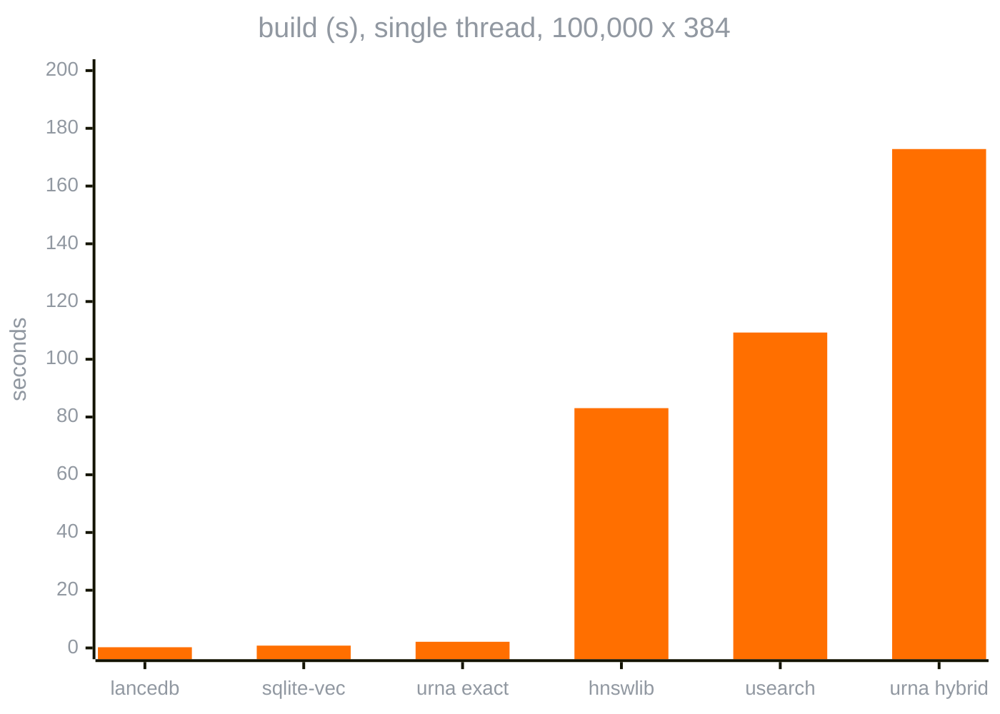
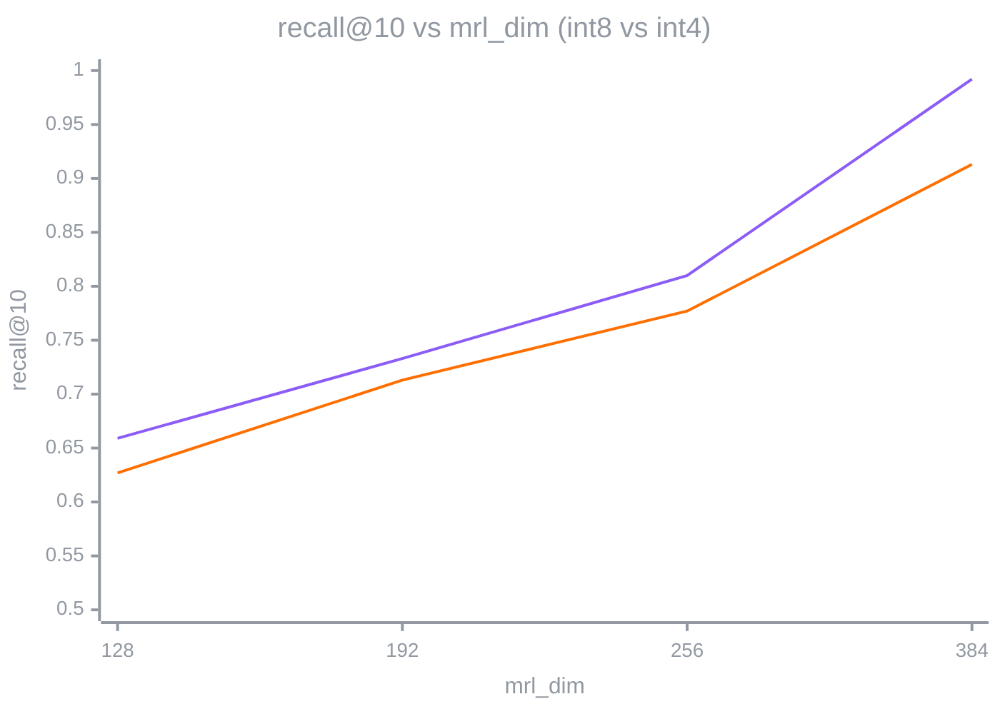

# urna

single-file, memory-mapped, hash-verified vector database with stable citations.

one `.urna` file carries chunks, embeddings, source spans, media, indices, and a search contract. a rust runtime mmaps it and answers with exact-cosine scores and `urna://content_hash/chunk_id` citations that survive re-encoding. reproducible byte for byte, offline by construction: the file is the whole database and nothing phones home.

python builds. rust serves. urna ships.

> renamed from `nest` after v0.4.0. same container, new name: file magic `URNA`, extension `.urna`, citations `urna://`, crates `urna-*`, wheel `urna`, env vars `URNA_*`. a `.nest` written by 0.4.0 or earlier still opens: the reader accepts the old `NEST` magic, the writer only emits `URNA`. details in `doc/CHANGELOG`.

no server to run, no api call, no central index to audit. ship a curated knowledge base inside the application; every answer points at a chunk you can verify.

warm p50 vs p99 per store, 100k x 384 rows, log scale, bottom-left is fastest and flattest



the two urna points verify every byte before the first answer and return recall@10 = 1.000. numbers per point: [doc/benchmarks.md](doc/benchmarks.md).

## sovereign, enforced by the format

four properties, held by the bytes, not by policy.

| property       | what the format enforces |
|----------------|--------------------------|
| self-contained | the file is the entire knowledge base; copy it like a sqlite db |
| verifiable     | sha-256 per section, per file, and over the decoded content; every hit cites `urna://content_hash/chunk_id` and `urna cite` resolves it to the stored text |
| reproducible   | same chunks + same model fingerprint + `reproducible=True` = byte-identical `file_hash` on any machine |
| offline-first  | the runtime never opens a socket; a model mismatch fails loudly at the `model_hash` gate |

## install

```sh
curl -sSf https://raw.githubusercontent.com/hoffresearch/urna/main/scripts/install.sh | sh
```

```sh
urna doctor
```

```sh
pip install "urna[embed]"     # python; offline embedding via the bundled potion table
```

also windows (`install.ps1`), homebrew tap, `cargo binstall urna-cli`, docker. artifacts carry sha256 + sigstore attestations. channels, verification, offline notes, and the maintainer checklist: the reference section of [doc/usage.md](doc/usage.md#reference). the release channels serve from `v0.4.0` on; `v0.3.0` predates the pipeline and carries no artifacts.

<details>
<summary>dev build (rust edition 2024, python 3.12+)</summary>

```sh
cargo build --release --workspace
```

```sh
cargo build --release -p urna-python --features pyo3/extension-module
```

```sh
cp target/release/lib_urna.dylib python/_urna.so   # macOS
```

```sh
cp target/release/lib_urna.so python/_urna.so      # linux
```

</details>

## cli

<details>
<summary>one binary, two groups of verbs</summary>

one binary, two groups of verbs. the engine takes a file and a vector and never runs python; the agent verbs take text or a build spec, shell out to the offline python embedder or the forge, and speak in cited answers. every printed score is the exact-cosine rerank value.

</details>

<details>
<summary>agent verbs: ask, retrieve, build</summary>

cited answer, offline, `--disclose explain` adds the rerank-source honesty line:

```sh
urna ask my_corpus.urna "can I use this offline" -k 3
```

json/jsonl answer-pack of cited spans, `score` is the exact rerank value:

```sh
urna retrieve my_corpus.urna "can I use this offline" -k 5 --format jsonl
```

declarative corpus build from one toml (source + media + one or several embedding models):

```sh
urna build --spec corpus.toml
```

plan and dependency status without loading anything:

```sh
urna build --spec corpus.toml --dry-run
```

`build` takes one toml describing the source (sqlite query, csv/jsonl, image dir), the media (av1/avif/jxl, dedup, `crf="auto"` dual quality gate), and one or several embedding models from the registry (`potion`, `clip-vit-b32`, `siglip2`, `wemm-2b`, ...), each a named vector space in the same file. `ask`/`retrieve` embed offline and validate `model_hash` against the manifest. contract and knobs, with a full worked spec: [doc/usage.md](doc/usage.md) section 13.

</details>

<details>
<summary>engine verbs: search family</summary>

exact top-k over the whole file:

```sh
urna search my_corpus.urna "[0.1, 0.2, ...]" -k 10
```

hnsw candidates, exact rerank:

```sh
urna search-ann my_corpus.urna "[0.1, 0.2, ...]" -k 10 --ef 200
```

chunk-graph bfs from the seeds, exact rerank:

```sh
urna search-graph my_corpus.urna "[0.1, 0.2, ...]" -k 10 --hops 2 --ef 100
```

one named multimodal space:

```sh
urna search-space my_corpus.urna "[0.1, ...]" --space "wemm-2b@256" -k 5
```

embed the text, gate on `model_hash`, route by manifest capability:

```sh
urna search-text my_corpus.urna "vacina contra covid funciona" -k 5
```

</details>

<details>
<summary>engine verbs: inspect, validate, stats, cite, media, benchmark, doctor</summary>

human-readable manifest and sections:

```sh
urna inspect my_corpus.urna
```

structured, for scripts:

```sh
urna inspect my_corpus.urna --json | jq
```

verify every checksum (per section, per file, decoded content):

```sh
urna validate my_corpus.urna
```

size, counts, encodings:

```sh
urna stats my_corpus.urna
```

resolve a citation to the stored canonical text and its verifying hashes:

```sh
urna cite my_corpus.urna 'urna://sha256:1aa9.../sha256:8f314...'
```

list the inlined media blobs, sha256-verified:

```sh
urna media my_corpus.urna
```

export every blob, each verified against its `blob_refs` sha256:

```sh
urna media my_corpus.urna --export DIR
```

latency and recall on this machine:

```sh
urna benchmark my_corpus.urna -q 100 -k 10 --ann 100 --madvise-cold
```

install health check, exit code per layer:

```sh
urna doctor
```

</details>

## python

`urna.open` returns a mmap-backed `UrnaFile`; every hit carries `citation_id`, `source_uri`, byte offsets, and the exact-rerank `score`.

<details>
<summary>open and retrieve</summary>

```python
import sys

sys.path.insert(0, "python")
import urna

db = urna.open("my_corpus.urna")
```

cited hits, routed by manifest capability (exact, hnsw, hybrid, graph):

```python
hits = db.retrieve(qvec, 5)
print(hits[0].citation_id, hits[0].score, hits[0].text)
```

same, refusing a corpus built with another model:

```python
hits = db.retrieve(qvec, 5, expected_model_hash=embedder.model_hash)
```

</details>

<details>
<summary>search variants</summary>

exact:

```python
db.search(qvec, 5)
```

hnsw candidates, exact rerank (falls back to exact when the file has no hnsw section):

```python
db.search_ann(qvec, 5, 100)
```

bm25 union vector candidates, exact rerank:

```python
db.search_hybrid(qvec, "vacina contra covid", 5, 100)
```

chunk-graph bfs from the seeds:

```python
db.search_graph(qvec, 5, hops=2, ef=100)
```

one named multimodal space:

```python
db.search_space("clip-vit-b32", ivec, 5)
```

</details>

<details>
<summary>validate and inspect</summary>

```python
assert db.validate() is True
```

```python
info = db.inspect()  # manifest, sections, hashes
```

</details>

<details>
<summary>build</summary>

each chunk is a dict with `canonical_text`, `source_uri`, `byte_start`, `byte_end`, `embedding`:

```python
urna.build(
    output_path="my_corpus.urna",
    embedding_model="sentence-transformers/paraphrase-multilingual-MiniLM-L12-v2",
    embedding_dim=384,
    chunker_version="fixed-512/1",
    model_hash=model_hash,
    chunks=chunks,
    reproducible=True,
    preset="hybrid",
)
```

matryoshka prefix truncation is a build-time kwarg, valid for int4 at 256, 192, 128:

```python
urna.build(..., preset="micro", mrl_dim=256)
```

or `Pipeline` in `python/builder.py` (chunker, sqlite cache, auto-validate). offline demo, builds from the cc0 demo corpus and asks one question:

```sh
python python/forge/retrieve.py
```

</details>

## benchmarks

<details>
<summary>urna vs usearch, hnswlib, sqlite-vec, lancedb, and the preset ladder</summary>

[doc/benchmarks.md](doc/benchmarks.md): urna against usearch, hnswlib, sqlite-vec and lancedb on the same 100,000 x 384 rows, same machine, same ruler. urna hybrid answers at recall@10 = 1.000 with p50 0.72 ms (hnsw candidates, exact-cosine rerank), rebuilds byte-identically, and is the only store in the table that proves its own bytes; the price is a cold open of ~290 ms (every checksum is verified before the first query) and an hnsw build 2.1x slower than hnswlib single-threaded (was 2.4x before the build loop was tuned). the table also lists what urna does not do (updates, filters, concurrent writers).

<details>
<summary>preset ladder: size vs recall</summary>

---
size ratio vs recall@10 per preset, 30,725-chunk pt-br corpus, top-left is small and stable



---
</details>

<details>
<summary>competitors: warm latency</summary>

---
warm p50 per store, single thread, python call overhead inside every number, lower is better



---
warm p99 per store, the tail the p50 hides



---
</details>

<details>
<summary>competitors: cold open and build</summary>

---
cold open + first query per store. urna verifies every section checksum and the footer hash before serving; the other stores trust their bytes



---
single-threaded build time per store. urna's hnsw build is the slow row, 2.1x hnswlib



---
</details>

<details>
<summary>matryoshka curve: recall vs prefix dim</summary>

---
recall@10 as the l2-normalized prefix shrinks, int8 and int4 ladders. the shipped MiniLM corpus is not mrl-trained, so truncation costs measured recall



int8 at 384 is the `tiny` preset, int4 at 384 is `nano`. int4 packs blocks of 64, so the ladder stops at 128; int8 also measures 96 (recall 0.574, size ratio 0.182), off the chart. the recall ruler is self-perturbation (rank stability under quantization), not real-query quality.

---
</details>

</details>

<details>
<summary>image corpus: 38,627 magic cards in one file, five image models, and what came back into urna</summary>

[brennercruvinel/mtg-urna-benchmark](https://github.com/brennercruvinel/mtg-urna-benchmark) (code, specs, twenty experiments) and the dataset on the hub, [brennercruvinel/mtg-urna-benchmark](https://huggingface.co/datasets/brennercruvinel/mtg-urna-benchmark) (ten `.urna` files, 11.7 GB, plus a parquet view). 4 GB of jpeg scans, one card per oracle id, packed by the forge into single files with the text, the vectors, the index and the media inside.

| profile | media | file | ratio vs the jpeg source |
|---------|-------|-----:|-------------------------:|
| `archive` | jpeg xl byte-reversible repack | 3.61 GB | 1.10x, every jpeg back bit for bit |
| `stills` | av1 all-intra crf35 tune still | 1.37 GB | 2.89x |
| `retrieval` | av1 all-intra crf50 | 533 MB | 7.46x, no measurable search loss |
| `stills-5models` | the stills media with potion, clip, siglip2, jina and wemm-2b | 1.44 GB | 2.75x |

text-to-image search on the five-model file, every card as a query ("artwork of the card {name}"), hit@1 on 38,627 queries: siglip2 0.750, wemm-2b 0.744, jina 0.336, clip 0.098. siglip2 embeds the corpus in twelve minutes, wemm-2b in twenty-one hours. reading one card back from the av1 stream costs 27 ms on an m4, 23 of them ffmpeg starting.

what the benchmark put into urna: `${VAR}` in spec paths and the `retrieval` / `retrieval-auto` profiles (#131, #135), a hit@k utility floor on the crf=auto gate because cosine drift never said where search breaks (#135), the embed cache under xdg (#133), the avif `source_bytes` fix (#132), avif as a stills recipe with floors a real corpus reaches (#137), a batched decode that raised on every real stream and png intermediates that cost 8x the decode (#138), the avif worker count pinned because libaom writes other bytes with one thread (#139), `tune = "still"` as the default (#140), and a manifest that is key + ordinal instead of 13 MB (#141). the full record, one hypothesis per row with its verdict, is `docs/hypotheses.md` in the benchmark repository.

</details>

## presets

<details>
<summary>six levers, one corpus, measured</summary>

| preset       | text | embeddings  | ann | bm25 | size ratio | recall@10 |
|--------------|------|-------------|-----|------|-----------:|----------:|
| `exact`      | raw  | float32     | no  | no   |     1.000  |   1.0000  |
| `compressed` | zstd | float16     | no  | no   |     0.339  |   1.0000  |
| `tiny`       | zstd | int8        | yes | no   |     0.256  |   0.9920  |
| `micro`      | zstd | mrl256-int8 | yes | no   |     0.223  |   0.8100  |
| `nano`       | zstd | int4        | yes | no   |     0.209  |   0.9130  |
| `hybrid`     | zstd | float32     | yes | yes  |     0.609  |   1.0000  |

measured on a 30,725-chunk pt-br corpus (`dat/measure/ladder.json`, gated in ci). the recall ruler is self-perturbation, so it reports rank stability under quantization, not real-query quality; sub-int8 scores are real cosine at the stored precision, disclosed on every result. full honesty notes, the mrl curve, and the lever guide: [doc/usage.md](doc/usage.md) section 6.

</details>

## reference

<details>
<summary>docs</summary>

- [doc/usage.md](doc/usage.md): every verb, presets, offline mode, model registry, declarative builds, compression levers, and the install reference (channels, verification, maintainer checklist)
- [doc/benchmarks.md](doc/benchmarks.md): the competitor table, the charts, and how it was measured
- [doc/SECURITY.md](doc/SECURITY.md): reporting, scope, hardening notes (denied lints, the mutation-fuzz harness, the nightly soak), and the data-governance posture for distributed `.urna` files
- [doc/CHANGELOG](doc/CHANGELOG): releases and unreleased deltas, with measured numbers
- [dat/demo/Instructions.md](dat/demo/Instructions.md): the pt-br demo corpus sources and rebuild
- [brennercruvinel/mtg-urna-benchmark](https://github.com/brennercruvinel/mtg-urna-benchmark): the image-corpus benchmark (38,627 card scans in single-file `.urna` containers): code, specs, corpora as id lists, results per experiment; the `.urna` artifacts are on the hugging face dataset of the same name. private for now

</details>

<details>
<summary>architecture</summary>

python builds a deterministic container; a rust runtime mmaps it and answers exact, hnsw, bm25, graph, and per-space searches, always finishing with an exact-cosine rerank. the cli and the python api are thin surfaces over the same runtime.

- `urna-format`: frozen v1 container (layout, manifest, sections, encodings, hashes)
- `urna-runtime`: mmap, simd dispatch, indices, search with mandatory exact rerank
- `urna-cli`: the `urna` binary (engine verbs + `ask`/`retrieve` + declarative `build`)
- `urna-python`: pyo3 bridge (`urna.open`, `urna.build`, `UrnaFile.retrieve`)
- `python/`: writer pipeline, model registry, offline embedders, forge tooling

the full map (flows, contracts, inventory, and the visual sequence diagram) lives in [doc/arc/arc.toml](doc/arc/arc.toml).

</details>

<details>
<summary>contracts</summary>

- [.contracts/.agents/AGENTS.md](.contracts/.agents/AGENTS.md): the single instruction source for agents and contributors
- `./scripts/release_check.sh`: the merge gate; it documents itself by being the gate
- binary format v1 is frozen; encodings 4-255 and section ids 0x09+ are reserved inside v1, and `content_hash` is excluded from every additive section
- a malformed `.urna` that panics the runtime is a security bug: [doc/SECURITY.md](doc/SECURITY.md)

</details>

## license

MIT, see [doc/LICENSE](doc/LICENSE). [Hoff Research](https://hoffresearch.com)

made it simple, but significant (∂μfμν = jν)

author: brenner cruvinel 
