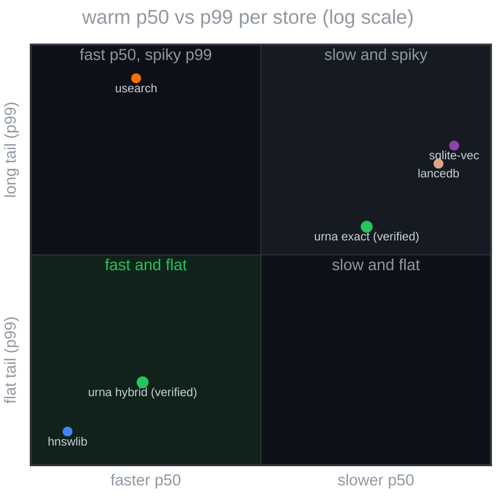
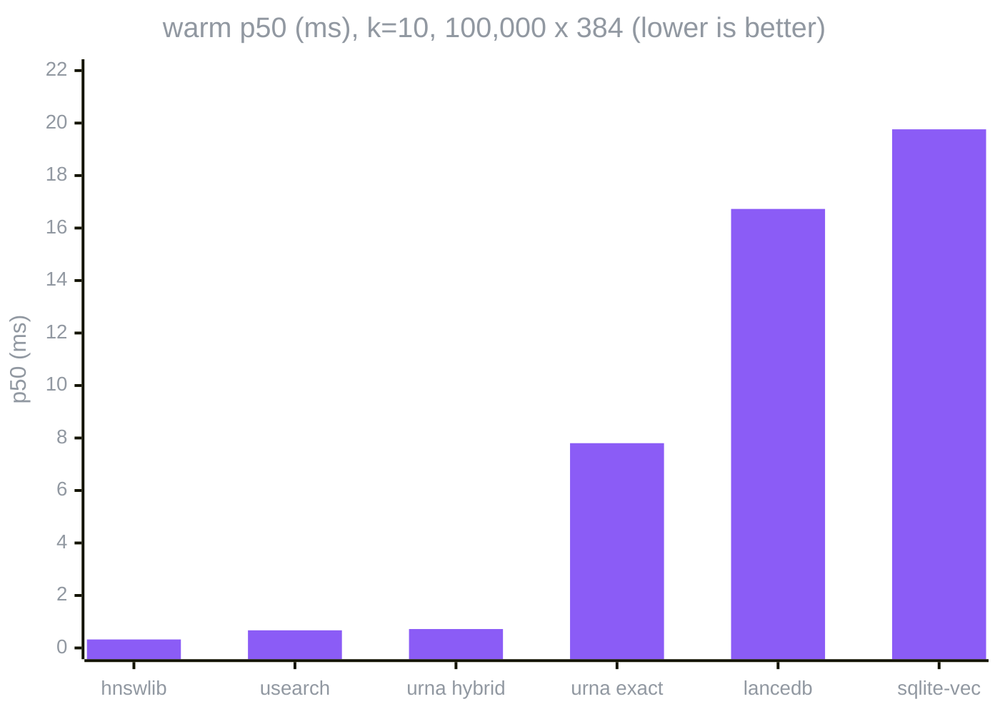
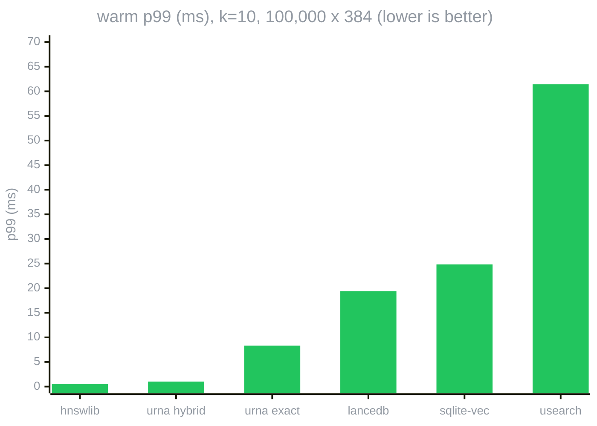
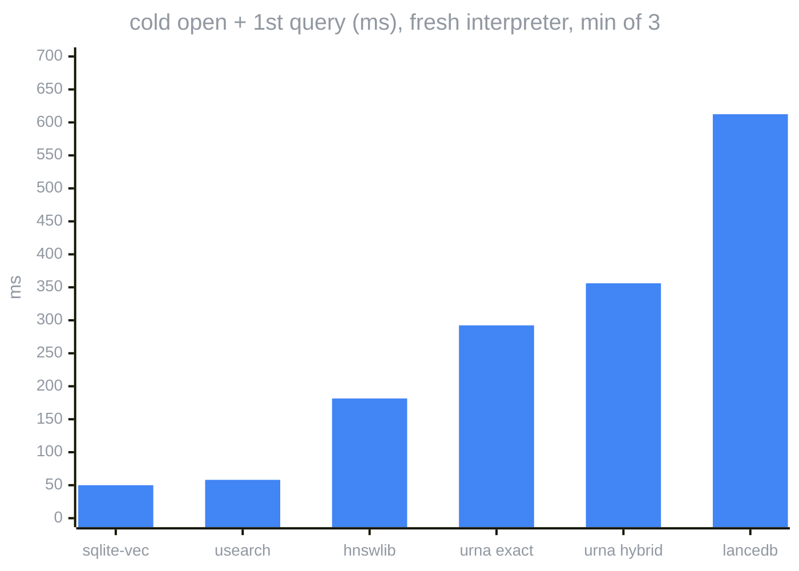
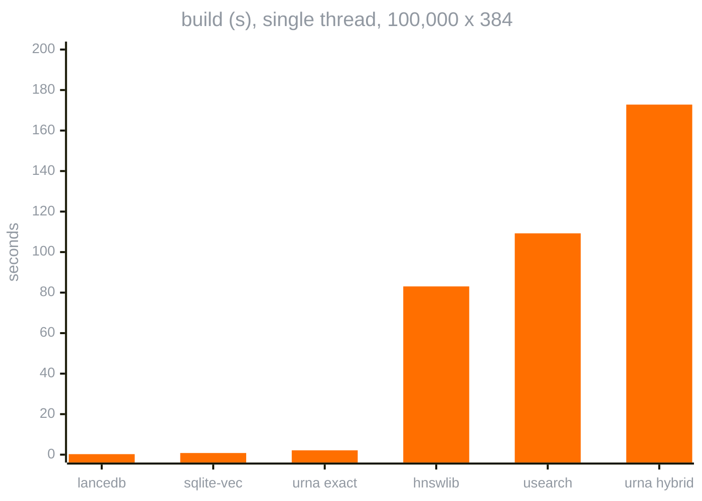

# benchmarks

measured 2026-09-10 on arm64 darwin 25.6.0, python 3.12.14, single thread, n=100,000 synthetic clustered l2-normalized rows x 384 dims (2000 centers), 200 queries, k=10, seed 7. reproduce: `.venv/bin/python python/tools/bench_competitors.py --n 100000 --dim 384 --queries 200`.

> [!TIP]
> verify these results on your own hardware with your own parameters: the command above regenerates the whole table, and `--n`, `--dim`, `--queries` set the corpus and the query count. every urna row is a real build, opened and validated before the first query.

| system | path | build (s) | bytes on disk | cold open + 1st query (ms) | p50 (ms) | p99 (ms) | recall@10 | rebuild byte-identical | integrity check |
|---|---|---|---|---|---|---|---|---|---|
| urna (exact) | exact | 2.14 | 165,290,134 | 292.3 | 7.803 | 8.315 | 1.0 | yes | yes (sha256 per section + file + content) |
| urna (hybrid) | ann (hnsw) | 172.82 | 163,221,498 | 356.1 | 0.721 | 1.021 | 1.0 | yes | yes (sha256 per section + file + content) |
| usearch | ann (hnsw) | 109.26 | 168,453,808 | 58.1 | 0.672 | 61.422 | 0.995 | yes | no |
| hnswlib | ann (hnsw) | 83.07 | 168,449,236 | 181.5 | 0.324 | 0.525 | 1.0 | yes | no |
| sqlite-vec | exact | 0.81 | 156,606,464 | 50.0 | 19.762 | 24.836 | 1.0 | yes | structural only (pragma integrity_check) |
| lancedb | exact | 0.25 | 153,799,983 | 612.4 | 16.728 | 19.401 | 1.0 | no | no |

how to read it:

- `cold open + 1st query`: wall time of a fresh interpreter that opens the store and answers one query, minus an interpreter doing nothing (3 runs, min). urna's number is dominated by `open` verifying every section checksum and the footer hash over the whole file before serving anything; the other stores trust their bytes.
- `build (s)`: single-threaded everywhere (hnswlib and usearch are told threads=1); urna's hnsw build is the slow row.
- `p50 / p99`: warm, single-threaded, one query at a time, from python. python call overhead is inside every number.
- `recall@k` is against brute force over the same rows; exact paths are asserted at 1.0.
- `rebuild byte-identical`: two builds from the same rows compared by sha256 over the artefact (a directory is hashed file by file).
- `integrity check`: whether the store can prove its own bytes. urna verifies sha256 per section, per file and over the decoded content on `validate()`.
- the same rows written with raw text and with zstd text share one `content_hash`: `True`. re-encoding never moves a `urna://content_hash/chunk_id` citation; the other stores have no equivalent notion.

## charts

the same table, drawn. every number below is a cell of the table above.

warm p50 vs p99 per store, log scale, bottom-left is fastest and flattest

warm p50 per store, lower is better

warm p99 per store, the tail the p50 hides

cold open + first query. urna verifies every section checksum and the footer hash before serving; the other stores trust their bytes

single-threaded build time. urna's hnsw build is the slow row, 2.1x hnswlib

what urna does not do that some of these do: in-place updates or deletes, metadata filtering, concurrent writers, a query language. it is a build-once, ship-and-query file; the table says nothing about workloads that need those.

versions: {"usearch": "2.26.2", "hnswlib": "0.8.0", "sqlite-vec": "0.1.9", "lancedb": "0.38.0", "numpy": "2.5.2"}
